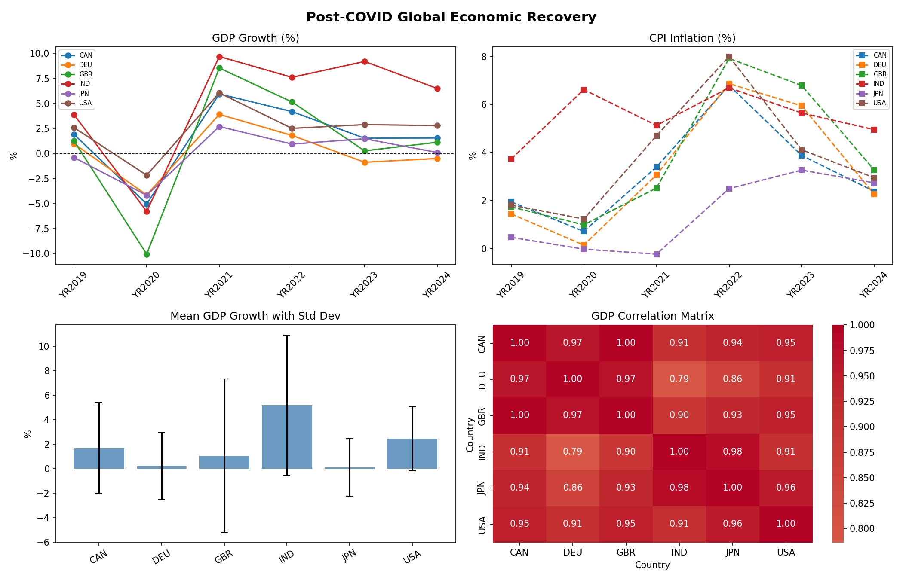

# Global Economic Pivot (2019-2024)
​I put this together to see how different countries actually handled the recovery after 2020. I wanted to check if the "pivot" from crashing GDP to high inflation happened at the same time everywhere.
​### The Visuals
​Here is the dashboard the code generated:

### What I did
​Data: Used the wbgapi to pull real stats from the World Bank for India, USA, UK, Canada, Germany, and Japan.
​Stats: Wrote a script to calculate the mean and skewness. The correlation matrix shows that these economies moved in almost perfect lockstep (most are above 0.90).
​The Trend: You can see the huge GDP bounce in 2021, which basically led straight into the inflation surge in 2022.
